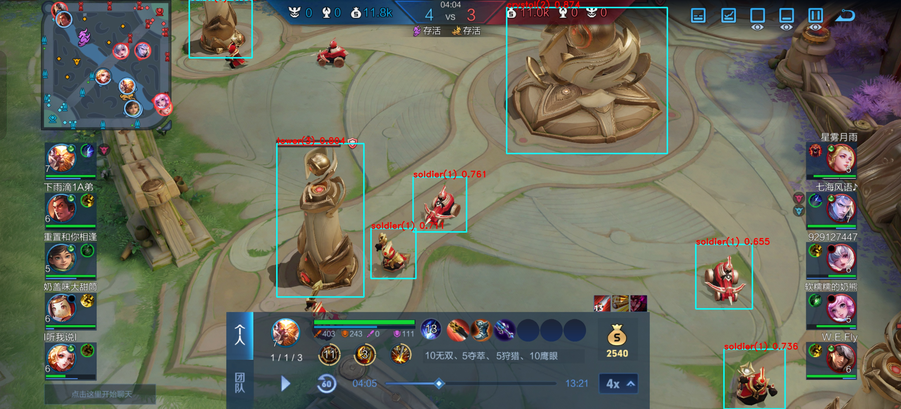

# yolo 王者目标识别

## 准备素材

### 素材来源

素材的来源主要是：

- 训练营：以摆拍为主（train 开头的素材集）
  - hero：各种英雄转方向，转角度，释放技能。
  - soldier：各种兵，如小兵，魔法师，弩车，超级兵，主宰兵（紫色），风暴龙王兵（橙色）。注意红蓝双方兵不一样。
  - crystol：水晶
  - tower：防御塔，注意四分钟前的一塔前面有个盾牌，以及红蓝双方区别。
  - grass：草丛（草会动，可以多截图几张）
  - dragon：两只手的主宰和暴君，四只手的主宰和暴君，风暴龙王。注意开龙期间是有动画的可以录一下。
  - buff：红蓝buff，注意各种视角和打人的动画。
  - monster：野怪，注意各种视角和打人的动画。红蓝双方视角问题可能野怪的方向不同
- 回放：以不同视角为主，部分情况可能会有角色原地做移动动画的情况，或者特效没出来。
- 实时录制（round 开头的素材集）：打就行了
- 屏幕截图（screenshot 开头的素材集）：作为补充

### 制备训练集

使用 FFmpge 切割素材为图片，大约三秒一张图，视情况而定。

#### FFMpeg 

参阅 [ffmpeg隔几秒取一帧](https://blog.csdn.net/racesu/article/details/109491612)。

- `q:v`: 0到51的整数值作为输入。这个范围中的值越小，视频的质量就越好，但文件大小也越大。
- `fps=fps=1/3`：每 3 秒一张图
- `round1-1/d.jpg`: 输出位置和格式

```bash
ffmpeg.exe -i round1-1.mp4 -f image2 -q:v 2 -vf fps=fps=1/3 round1-1/image-round1-1-%3d.jpg
```

#### 标记

##### 使用 X-AnyLabeling

参阅 [文档](https://github.com/CVHub520/X-AnyLabeling/blob/main/README_zh-CN.md#%E6%96%87%E6%A1%A3)。

###### 安装 X-AnyLabeling

参阅 [1.1 从源码运行](https://github.com/CVHub520/X-AnyLabeling/blob/main/docs/zh_cn/get_started.md#11-%E4%BB%8E%E6%BA%90%E7%A0%81%E8%BF%90%E8%A1%8C)。

###### 使用 X-AnyLabeling

参阅 [用户手册](https://github.com/CVHub520/X-AnyLabeling/blob/main/docs/zh_cn/user_guide.md)。

###### 使用预训练模型标记图片

参阅 [加载已适配的用户自定义模型](https://github.com/CVHub520/X-AnyLabeling/blob/main/docs/zh_cn/custom_model.md#%E5%8A%A0%E8%BD%BD%E5%B7%B2%E9%80%82%E9%85%8D%E7%9A%84%E7%94%A8%E6%88%B7%E8%87%AA%E5%AE%9A%E4%B9%89%E6%A8%A1%E5%9E%8B)。

使用 [yolo11-seg.yaml](https://github.com/ultralytics/ultralytics/blob/main/ultralytics/cfg/models/11/yolo11-seg.yaml) 作为模型参数训练用于标记的预训练模型。

使用 [x-label.yaml](./x-label/x-label.yaml)

```yaml
type: yolo11_seg
name: yolo11s-seg-wangzhe
display_name: YOLO11s-Seg 王者荣耀实例分割模型
model_path: best.onnx
nms_threshold: 0.45
confidence_threshold: 0.25
classes:
  - hero
  - soldier
  - crystol
  - tower
  - grass
  - dragon
  - buff
  - monster
```

```
yolo segment export format=onnx model=best.pt
```

###### 导出数据集

使用导出-导出 YOLO 分割标签导出**多边形**标记数据。

> 使用导出-导出 YOLO 水平框标签导出**矩形**标记数据。本实验不使用此选项。

使用的标签文件见 [classes.txt](data/classes.txt)。

## 训练模型

### 准备 YOLO 环境

参阅 [Install Ultralytics](https://docs.ultralytics.com/quickstart/#install-ultralytics)

### 模型参数

缩放常数选择 `n`（默认值）。

已验证的模型参数如下。

记得修改类型数目 `nc: 8 # number of classes`。

- [yolov8.yaml](https://github.com/ultralytics/ultralytics/blob/main/ultralytics/cfg/models/v8/yolov8.yaml)
- [yolo11.yaml](https://github.com/ultralytics/ultralytics/blob/main/ultralytics/cfg/models/11/yolo11.yaml)
- [yolov5.yaml](https://github.com/ultralytics/ultralytics/blob/main/ultralytics/cfg/models/v5/yolov5.yaml)：训练成功，转换失败。

以下使用 [yolov11.yaml](train/yolov11.yaml)。

### 数据集

数据集目录如下所示。参见 [dataset](data/dataset)。

```
.
├── images
│   └── screenshot-1
│       ├── 1.png # 图片应该放在此处，主文件名应该和标签对应。jpg和png图片测试可混用。
├── labels
│   ├── screenshot-1 # 两个子目录的文件夹应该同名
│   │   ├── 1.txt # 导出的标签文件应该放在此处
│   └── screenshot-1.cache # 由 yolo 自动生成
└── dataset.yaml
```

数据集描述文件见 [dataset.yaml](data/dataset/dateset.yaml)

### 训练代码

```python
from ultralytics import YOLO

def main():
    model = YOLO('yolov11.yaml')  # 从YAML建立模型层，如需从原有权重中加载，在最后添加 .load('best.pt')
    results = model.train(data="../data/dateset.yaml", epochs=200, imgsz=640, save=True, save_period=1) # data 数据集描述文件路径，epochs 迭代次数（建议200次以上），save=True, save_period 保存中间的权重以及保存周期

if __name__ == '__main__':
    main()
```

```
python train.py
```

训练完成后输出如下内容（节选）。最优权重保存在 `runs/detect/train/weights/best.pt`。

```
Validating runs\detect\train\weights\best.pt...
WARNING ⚠️ validating an untrained model YAML will result in 0 mAP.
Ultralytics 8.3.31 🚀 Python-3.11.10 torch-2.5.1 CUDA:0 (NVIDIA GeForce RTX 3070 Ti Laptop GPU, 8192MiB)
YOLOv11 summary (fused): 238 layers, 2,583,712 parameters, 0 gradients
                 Class     Images  Instances      Box(P          R      mAP50  mAP50-95): 100%|██████████| 5/5 [00:01<0
                   all        145        881      0.932      0.917      0.957      0.705
                  hero         51         74      0.872      0.825      0.917      0.551
               soldier         70        244      0.891      0.861      0.915      0.575
               crystol         21         21      0.987          1      0.995      0.865
                 tower         82        101      0.959      0.931      0.961      0.744
                 grass        114        379      0.953       0.96      0.989      0.768
                dragon         16         16      0.967          1      0.995      0.856
                  buff         11         11      0.898          1      0.988      0.761
               monster         22         35       0.93       0.76      0.895      0.517
Speed: 0.1ms preprocess, 0.9ms inference, 0.0ms loss, 0.7ms postprocess per image
Results saved to runs\detect\train
```

训练成果目录如下所示。

```
.
├── F1_curve.png
├── PR_curve.png
├── P_curve.png
├── R_curve.png
├── args.yaml
├── confusion_matrix.png
├── confusion_matrix_normalized.png
├── labels.jpg
├── labels_correlogram.jpg
├── results.csv
├── results.png
├── train_batch0.jpg
├── train_batch1.jpg
├── train_batch1900.jpg
├── train_batch1901.jpg
├── train_batch1902.jpg
├── train_batch2.jpg
├── val_batch0_labels.jpg
├── val_batch0_pred.jpg
├── val_batch1_labels.jpg
├── val_batch1_pred.jpg
├── val_batch2_labels.jpg
├── val_batch2_pred.jpg
└── weights
    ├── best.pt
    └── last.pt
```


### 导出 onxx 以供转换

参见 [模型编译](https://milkv.io/zh/docs/duo/application-development/tdl-sdk/tdl-sdk-yolov8#%E6%A8%A1%E5%9E%8B%E7%BC%96%E8%AF%91)。

[yolov8_export.py](https://github.com/milkv-duo/cvitek-tdl-sdk-sg200x/blob/main/sample/yolo_export/yolov8_export.py) 可从官方仓库下载。

```
python yolov8_export.py --weights best.pt --img-size 640 640
```

## 模型转换

参阅 [TPU-MLIR 转换模型](https://milkv.io/zh/docs/duo/application-development/tdl-sdk/tdl-sdk-yolov8#tpu-mlir-%E8%BD%AC%E6%8D%A2%E6%A8%A1%E5%9E%8B)

请参考 TPU-MLIR 文档 配置好 TPU-MLIR 工作环境，参数解析请参考 TPU-MLIR 文档。

配置好工作环境后,在与本项目同级目录下创建一个model_yolov8n目录,将模型和图片文件放入其中。

模型转换命令如下：

```
model_transform.py \
--model_name wangzhe \
--model_def ../best.onnx \
--input_shapes [[1,3,640,640]] \
--mean 0.0,0.0,0.0 \
--scale 0.0039216,0.0039216,0.0039216 \
--keep_aspect_ratio \
--pixel_format rgb \
--mlir wangzhe.mlir
```

```
run_calibration.py wangzhe.mlir \
--dataset ../wangzhe/ \
--input_num 100 \
-o wangzhe_cali_table
```

用校准表生成 int8 对称 cvimodel:

```
model_deploy.py \
--mlir wangzhe.mlir \
--quant_input --quant_output \
--quantize INT8 \
--calibration_table wangzhe_cali_table \
--processor cv181x \
--model wangzhe-int8-sym.cvimodel
```

## 运行模型

运行模型的代码见 [v8.cpp](duocode/v11.cpp)。替换 [sample_yolov8.cpp](https://github.com/milkv-duo/cvitek-tdl-sdk-sg200x/blob/main/sample/cvi_yolo/sample_yolov8.cpp) 按照 [简介](https://milkv.io/zh/docs/duo/application-development/tdl-sdk/tdl-sdk-introduction) 编译即可。

将编译好的 `sample_yolov8` 上传到开发板，运行 `./sample_yolov8 ./wangzhe-int8-sym.cvimodel ./test1.png ./test1-res.jpg` 即可。结果见 [result](result)。


```
[root@milkv-duo]~/test# ./sample_yolov8 ./wangzhe-int8-sym.cvimodel ./test1.jpg ./test1-res.jpg
enter CVI_TDL_Get_YOLO_Preparam...
asign val 0 
asign val 1 
asign val 2 
setup yolov8 param 
enter CVI_TDL_Get_YOLO_Preparam...
setup yolov8 algorithm param 
yolov8 algorithm parameters setup success!
---------------------openmodel-----------------------
version: 1.4.0
wangzhe Build at 2024-11-17 19:24:30 For platform cv181x
Max SharedMem size:2508800
---------------------to do detection-----------------------
image read,width:1920
image read,hidth:858
objnum:4
Detect grass(4): 90.915665 236.684692 390.640045 378.852448 0.857979
Detect grass(4): 418.214081 0.000000 990.932739 296.319122 0.840113
Detect hero(0): 891.314758 335.666199 1061.741699 513.453491 0.683700
Detect soldier(1): 1743.092651 301.290161 1811.119263 366.127258 0.532074
[root@milkv-duo]~/test# ./sample_yolov8 ./wangzhe-int8-sym.cvimodel ./test2.jpg ./test2-res.jpg
enter CVI_TDL_Get_YOLO_Preparam...
asign val 0 
asign val 1 
asign val 2 
setup yolov8 param 
enter CVI_TDL_Get_YOLO_Preparam...
setup yolov8 algorithm param 
yolov8 algorithm parameters setup success!
---------------------openmodel-----------------------
version: 1.4.0
wangzhe Build at 2024-11-17 19:24:30 For platform cv181x
Max SharedMem size:2508800
---------------------to do detection-----------------------
image read,width:1920
image read,hidth:858
objnum:7
Detect grass(4): 403.539185 0.000000 962.936279 294.031677 0.932570
Detect grass(4): 44.974777 208.389542 368.346405 382.994202 0.776312
Detect soldier(1): 775.996765 615.650940 893.828613 752.587891 0.683700
Detect soldier(1): 1476.970947 79.870880 1571.113770 189.782959 0.595178
Detect soldier(1): 1386.461670 125.734772 1466.339600 241.368347 0.563885
Detect soldier(1): 1389.500122 161.383987 1481.125122 262.750854 0.563885
Detect soldier(1): 604.313110 754.505981 707.879395 857.000000 0.563885
[root@milkv-duo]~/test# ./sample_yolov8 ./wangzhe-int8-sym.cvimodel ./test3.jpg ./test3-res.jpg
enter CVI_TDL_Get_YOLO_Preparam...
asign val 0 
asign val 1 
asign val 2 
setup yolov8 param 
enter CVI_TDL_Get_YOLO_Preparam...
setup yolov8 algorithm param 
yolov8 algorithm parameters setup success!
---------------------openmodel-----------------------
version: 1.4.0
wangzhe Build at 2024-11-17 19:24:30 For platform cv181x
Max SharedMem size:2508800
---------------------to do detection-----------------------
image read,width:1920
image read,hidth:858
objnum:3
Detect grass(4): 1037.632812 0.000000 1313.217529 104.026978 0.841593
Detect grass(4): 543.624390 441.974030 823.163696 675.228882 0.820658
Detect grass(4): 1259.752441 531.114441 1664.768188 857.000000 0.751391
[root@milkv-duo]~/test# ./sample_yolov8 ./wangzhe-int8-sym.cvimodel ./test4.jpg ./test4-res.jpg
enter CVI_TDL_Get_YOLO_Preparam...
asign val 0 
asign val 1 
asign val 2 
setup yolov8 param 
enter CVI_TDL_Get_YOLO_Preparam...
setup yolov8 algorithm param 
yolov8 algorithm parameters setup success!
---------------------openmodel-----------------------
version: 1.4.0
wangzhe Build at 2024-11-17 19:24:30 For platform cv181x
Max SharedMem size:2508800
---------------------to do detection-----------------------
image read,width:1920
image read,hidth:858
objnum:4
Detect grass(4): 4.928364 481.490112 374.961304 857.000000 0.901330
Detect grass(4): 1126.676758 0.053284 1432.554688 147.111145 0.804268
Detect grass(4): 611.394897 186.654419 1005.244873 539.607056 0.776312
Detect grass(4): 930.379395 98.758987 1454.645874 381.534576 0.602230
[root@milkv-duo]~/test# ./sample_yolov8 ./wangzhe-int8-sym.cvimodel ./test5.png ./test5-res.jpg
enter CVI_TDL_Get_YOLO_Preparam...
asign val 0 
asign val 1 
asign val 2 
setup yolov8 param 
enter CVI_TDL_Get_YOLO_Preparam...
setup yolov8 algorithm param 
yolov8 algorithm parameters setup success!
---------------------openmodel-----------------------
version: 1.4.0
wangzhe Build at 2024-11-17 19:24:30 For platform cv181x
Max SharedMem size:2508800
---------------------to do detection-----------------------
image read,width:3168
image read,hidth:1440
objnum:7
Detect crystol(2): 1781.433594 26.692432 2346.078857 540.206177 0.873866
Detect tower(3): 973.372681 505.802856 1279.624634 1045.728394 0.804268
Detect soldier(1): 1452.727295 623.431396 1640.592407 816.327576 0.760650
Detect soldier(1): 2545.095947 1229.370605 2760.516846 1439.000000 0.736484
Detect soldier(1): 1304.465210 804.322693 1462.080322 980.739136 0.710806
Detect tower(3): 665.742432 0.000000 886.644775 203.547089 0.655286
Detect soldier(1): 2446.042236 860.136475 2645.260010 1087.134399 0.655286
[root@milkv-duo]~/test# ./sample_yolov8 ./wangzhe-int8-sym.cvimodel ./test6.png ./test6-res.jpg
enter CVI_TDL_Get_YOLO_Preparam...
asign val 0 
asign val 1 
asign val 2 
setup yolov8 param 
enter CVI_TDL_Get_YOLO_Preparam...
setup yolov8 algorithm param 
yolov8 algorithm parameters setup success!
---------------------openmodel-----------------------
version: 1.4.0
wangzhe Build at 2024-11-17 19:24:30 For platform cv181x
Max SharedMem size:2508800
---------------------to do detection-----------------------
image read,width:3168
image read,hidth:1440
objnum:7
Detect tower(3): 1267.669434 713.675537 1587.508301 1164.443726 0.804268
Detect soldier(1): 1485.243408 640.722229 1676.660767 816.582153 0.760650
Detect tower(3): 1997.918091 70.318085 2214.204102 338.551453 0.736484
Detect soldier(1): 1920.136230 423.432953 2066.384766 576.405640 0.736484
Detect grass(4): 1482.762573 82.517021 1673.772217 264.839294 0.710806
Detect soldier(1): 1741.007812 511.173859 1890.553589 675.679016 0.655286
Detect grass(4): 2630.007080 1197.088623 3067.743408 1437.694458 0.595178
[root@milkv-duo]~/test# ./sample_yolov8 ./wangzhe-int8-sym.cvimodel ./test7.png ./test7-res.jpg
enter CVI_TDL_Get_YOLO_Preparam...
asign val 0 
asign val 1 
asign val 2 
setup yolov8 param 
enter CVI_TDL_Get_YOLO_Preparam...
setup yolov8 algorithm param 
yolov8 algorithm parameters setup success!
---------------------openmodel-----------------------
version: 1.4.0
wangzhe Build at 2024-11-17 19:24:30 For platform cv181x
Max SharedMem size:2508800
---------------------to do detection-----------------------
image read,width:3168
image read,hidth:1440
objnum:12
Detect grass(4): 2044.599365 872.475708 2454.618164 1156.496460 0.857979
Detect grass(4): 2399.635254 723.132019 2825.844727 970.528259 0.823706
Detect grass(4): 2586.780029 195.426590 2862.163330 494.901917 0.783252
Detect grass(4): 147.981277 414.233429 397.310699 544.300537 0.736484
Detect tower(3): 2002.271851 57.844669 2243.907227 334.110504 0.710806
Detect grass(4): 571.654663 125.627403 886.539917 385.061401 0.710806
Detect hero(0): 1440.644897 638.255676 1624.099243 867.324036 0.683700
Detect grass(4): 20.100384 7.809604 140.061340 230.685074 0.655286
Detect soldier(1): 1214.385010 612.603699 1352.926392 759.386108 0.655286
Detect soldier(1): 793.285034 806.322937 922.931030 944.308716 0.655286
Detect hero(0): 780.677124 139.779648 1014.197754 383.148499 0.595178
Detect soldier(1): 1338.223999 545.199402 1462.769043 698.705872 0.563885
[root@milkv-duo]~/test# ./sample_yolov8 ./wangzhe-int8-sym.cvimodel ./test8.png ./test8-res.jpg
enter CVI_TDL_Get_YOLO_Preparam...
asign val 0 
asign val 1 
asign val 2 
setup yolov8 param 
enter CVI_TDL_Get_YOLO_Preparam...
setup yolov8 algorithm param 
yolov8 algorithm parameters setup success!
---------------------openmodel-----------------------
version: 1.4.0
wangzhe Build at 2024-11-17 19:24:30 For platform cv181x
Max SharedMem size:2508800
---------------------to do detection-----------------------
image read,width:3168
image read,hidth:1440
objnum:6
Detect grass(4): 2305.111328 502.570587 2817.546875 821.567505 0.928868
Detect soldier(1): 1622.615601 895.127747 1837.830566 1151.653687 0.760650
Detect grass(4): 5.026778 578.812317 235.149124 894.203674 0.710806
Detect tower(3): 1279.594971 390.505676 1611.648682 882.607422 0.683700
Detect soldier(1): 2551.292480 954.174133 2806.171387 1161.206909 0.683700
Detect soldier(1): 2050.965088 910.393311 2321.228271 1136.329956 0.595178
[root@milkv-duo]~/test# ./sample_yolov8 ./wangzhe-int8-sym.cvimodel ./test9.png ./test9-res.jpg
enter CVI_TDL_Get_YOLO_Preparam...
asign val 0 
asign val 1 
asign val 2 
setup yolov8 param 
enter CVI_TDL_Get_YOLO_Preparam...
setup yolov8 algorithm param 
yolov8 algorithm parameters setup success!
---------------------openmodel-----------------------
version: 1.4.0
wangzhe Build at 2024-11-17 19:24:30 For platform cv181x
Max SharedMem size:2508800
---------------------to do detection-----------------------
image read,width:3168
image read,hidth:1440
objnum:5
Detect grass(4): 1973.036865 287.334076 2638.095215 701.015930 0.873866
Detect grass(4): 714.001526 0.000000 1023.952332 144.343918 0.841593
Detect grass(4): 572.839966 101.798050 967.360840 391.481140 0.760650
Detect hero(0): 2010.885742 226.585022 2151.338623 436.618866 0.736484
Detect dragon(5): 999.865112 160.920853 1845.312012 953.739380 0.602230
```


